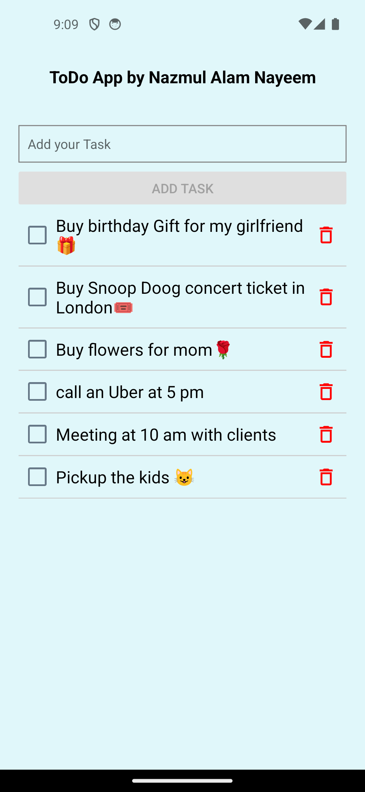
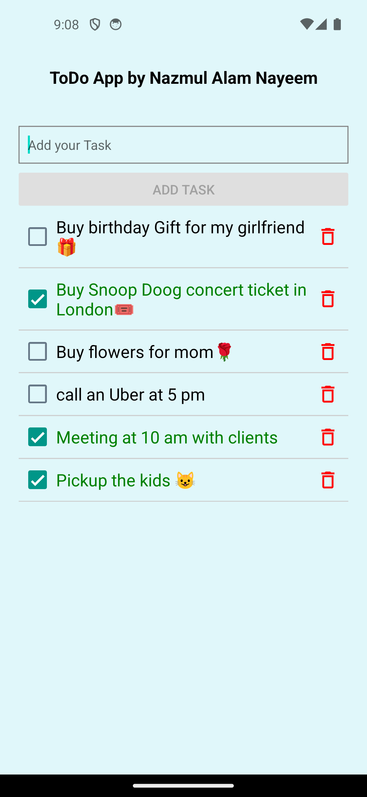

# ToDo App

A simple ToDo App built with React Native and Expo for managing tasks efficiently.

## Screenshots

  
  

## Features

- **Add Task**: Create tasks with a title. Default status is 'due/false', which can be toggled to 'done/true'.
  
- **Edit Task Status**: Toggle the checkbox to switch between 'due/false' and 'done/true' status for each task.

- **Delete Task**: Remove tasks from the list with a single tap on the delete icon/button.

- **Task Creation Verification**: Ensure task creation by entering a title; the 'ADD TASK' button is disabled when the input field is empty.

## Usage

1. **Adding a Task**:
   - Enter a task title in the input field.
   - Tap 'Add Task' to create the task.

2. **Editing Task Status**:
   - Toggle the checkbox to switch between 'due/false' and 'done/true' status for each task.
   - Once toggled, the task text turns green to indicate completion.

3. **Deleting a Task**:
   - Tap the delete icon/button next to the task to delete it instantly.

4. **Verification for Task Creation**:
   - The 'ADD TASK' button remains disabled until a valid title is entered.

## Technologies Used

- React Native
- Expo
- JavaScript
